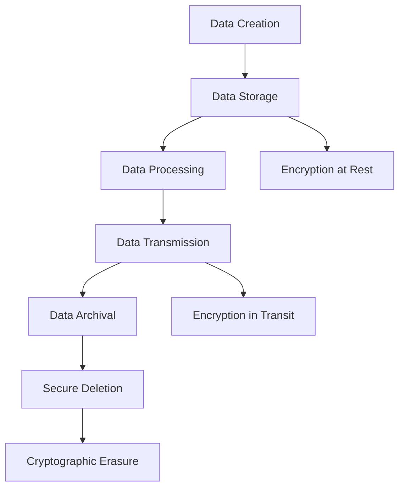
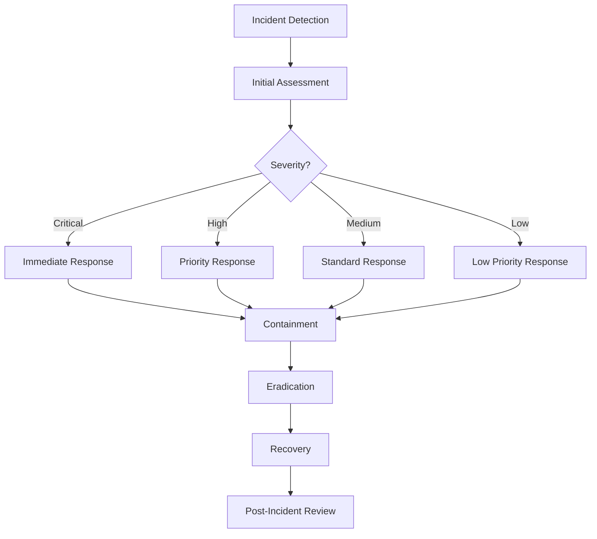

# FIDO2/WebAuthn Security Requirements

## Executive Summary

This document outlines the comprehensive security requirements for the FIDO2/WebAuthn Relying Party Server implementation. The requirements are designed to ensure FIDO Alliance compliance, protect against known vulnerabilities, and maintain the highest security standards for authentication systems.

## 1. Security Architecture Overview

### 1.1 Threat Model

#### 1.1.1 Primary Threat Actors
- **External Attackers**: Malicious actors attempting to compromise authentication
- **Insider Threats**: Authorized users with malicious intent
- **Advanced Persistent Threats (APTs)**: Sophisticated, targeted attacks
- **Automated Attackers**: Bots and scripts performing automated attacks

#### 1.1.2 Attack Vectors
- **Network Attacks**: Man-in-the-middle, replay, DoS
- **Cryptographic Attacks**: Signature forgery, key extraction
- **Application Attacks**: Injection, XSS, CSRF
- **Infrastructure Attacks**: Database compromise, server compromise

#### 1.1.3 Security Boundaries
- **Client-Browser**: WebAuthn API and browser security
- **Network Transport**: TLS and network security
- **Application Server**: WebAuthn service implementation
- **Database Storage**: Credential and user data storage
- **Infrastructure**: Server and network infrastructure

### 1.2 Defense in Depth Strategy

```
┌─────────────────────────────────────────────────────────┐
│                    Application Layer                    │
│  ┌─────────────────┐  ┌─────────────────┐  ┌─────────┐ │
│  │   Input         │  │   Business      │  │ Output  │ │
│  │   Validation    │  │   Logic         │  │ Encoding│ │
│  └─────────────────┘  └─────────────────┘  └─────────┘ │
├─────────────────────────────────────────────────────────┤
│                  Service Layer                          │
│  ┌─────────────────┐  ┌─────────────────┐  ┌─────────┐ │
│  │   WebAuthn      │  │   Session       │  │ Audit   │ │
│  │   Service       │  │   Management    │  │ Logging │ │
│  └─────────────────┘  └─────────────────┘  └─────────┘ │
├─────────────────────────────────────────────────────────┤
│                  Data Layer                             │
│  ┌─────────────────┐  ┌─────────────────┐  ┌─────────┐ │
│  │   Encryption    │  │   Access        │  │ Backup  │ │
│  │   at Rest       │  │   Control       │  │ Security│ │
│  └─────────────────┘  └─────────────────┘  └─────────┘ │
├─────────────────────────────────────────────────────────┤
│                Infrastructure Layer                     │
│  ┌─────────────────┐  ┌─────────────────┐  ┌─────────┐ │
│  │   Network       │  │   Host          │  │ Monitor │ │
│  │   Security      │  │   Security      │  │ & Alert │ │
│  └─────────────────┘  └─────────────────┘  └─────────┘ │
└─────────────────────────────────────────────────────────┘
```

## 2. Cryptographic Security Requirements

### 2.1 Algorithm Requirements

#### 2.1.1 Supported Algorithms
- **MUST Support**: ES256 (ECDSA with SHA-256, curve P-256)
- **MUST Support**: RS256 (RSASSA-PKCS1-v1_5 with SHA-256)
- **SHOULD Support**: EdDSA (Ed25519)
- **MUST Reject**: All other algorithms

#### 2.1.2 Key Size Requirements
- **ECDSA**: P-256 curve (256-bit prime field)
- **RSA**: Minimum 2048 bits, recommended 3072 bits
- **EdDSA**: Ed25519 (256-bit)
- **Symmetric**: AES-256-GCM for encryption

#### 2.1.3 Hash Function Requirements
- **MUST Use**: SHA-256 for all hashing operations
- **MUST Use**: SHA-384 for HMAC operations
- **MUST Reject**: MD5, SHA-1, and other weak hashes

### 2.2 Random Number Generation

#### 2.2.1 CSPRNG Requirements
- **MUST Use**: Cryptographically secure pseudo-random number generator
- **MUST Use**: Operating system provided CSPRNG (getrandom(), /dev/urandom)
- **MUST Ensure**: Minimum entropy of 256 bits for challenges
- **MUST Validate**: Randomness quality through statistical tests

#### 2.2.2 Challenge Generation
```rust
pub struct ChallengeGenerator {
    rng: Box<dyn CryptoRng + RngCore>,
}

impl ChallengeGenerator {
    pub fn generate_challenge(&mut self) -> Result<String, CryptoError> {
        let mut bytes = [0u8; 32];
        self.rng.fill_bytes(&mut bytes);
        Ok(base64url::encode(&bytes))
    }
    
    // Test for uniqueness
    #[cfg(test)]
    fn test_uniqueness(&mut self, iterations: usize) -> bool {
        let mut challenges = HashSet::new();
        for _ in 0..iterations {
            let challenge = self.generate_challenge().unwrap();
            if !challenges.insert(challenge) {
                return false; // Duplicate found
            }
        }
        true
    }
}
```

### 2.3 Signature Verification

#### 2.3.1 Verification Requirements
- **MUST Verify**: Signature algorithm matches credential
- **MUST Verify**: Signature format is valid (DER for ECDSA/RSA)
- **MUST Verify**: Public key matches credential
- **MUST Reject**: Signatures with low entropy (k reuse in ECDSA)

#### 2.3.2 Implementation Security
```rust
pub struct SignatureVerifier {
    // Use constant-time operations
    pub fn verify_ecdsa_signature(
        &self,
        public_key: &P256PublicKey,
        message: &[u8],
        signature: &[u8],
    ) -> Result<bool, CryptoError> {
        // Use constant-time comparison
        let verification_result = public_key
            .verify_verifying_bytes(message, signature)
            .is_ok();
        
        // Prevent timing attacks
        let result = if verification_result { 1 } else { 0 };
        Ok(ct_eq(result, 1))
    }
}
```

## 3. Data Protection Requirements

### 3.1 Data Classification

#### 3.1.1 Sensitivity Levels
- **Highly Sensitive**: Private keys, user biometrics (never stored)
- **Sensitive**: Credential IDs, user identifiers, challenge data
- **Internal**: User metadata, audit logs, configuration
- **Public**: RP information, API documentation

#### 3.1.2 Data Lifecycle


### 3.2 Encryption Requirements

#### 3.2.1 Encryption at Rest
- **Algorithm**: AES-256-GCM
- **Key Management**: Hardware Security Module (HSM) or KMS
- **Key Rotation**: Every 90 days or upon compromise
- **Data to Encrypt**: Credential IDs, user identifiers, challenges

#### 3.2.2 Encryption Implementation
```rust
pub struct DataEncryption {
    cipher: Aes256Gcm,
    key_id: String,
}

impl DataEncryption {
    pub fn encrypt(&self, plaintext: &[u8]) -> Result<Vec<u8>, EncryptionError> {
        let nonce = Aes256Gcm::generate_nonce(&mut OsRng);
        let ciphertext = self.cipher.encrypt(&nonce, plaintext)?;
        
        // Return nonce || ciphertext || tag
        let mut result = nonce.to_vec();
        result.extend_from_slice(&ciphertext);
        Ok(result)
    }
    
    pub fn decrypt(&self, data: &[u8]) -> Result<Vec<u8>, EncryptionError> {
        if data.len() < 12 {
            return Err(EncryptionError::InvalidData);
        }
        
        let (nonce, ciphertext) = data.split_at(12);
        let nonce = GenericArray::from_slice(nonce);
        self.cipher.decrypt(nonce, ciphertext)
            .map_err(|_| EncryptionError::DecryptionFailed)
    }
}
```

### 3.3 Key Management

#### 3.3.1 Key Hierarchy
```
Master Key (HSM/KMS)
├── Data Encryption Key (DEK)
│   ├── Credential Encryption
│   └── User Data Encryption
└── HMAC Key
    ├── Challenge Signing
    └── API Authentication
```

#### 3.3.2 Key Security Requirements
- **Master Key**: Stored in HSM or cloud KMS
- **DEK Rotation**: Every 30 days
- **Key Access**: Principle of least privilege
- **Key Backup**: Encrypted, offline storage
- **Key Destruction**: Cryptographic erasure

## 4. Authentication Security Requirements

### 4.1 WebAuthn Security

#### 4.1.1 Registration Security
- **Challenge Uniqueness**: Cryptographically unique per request
- **Challenge Expiration**: Maximum 5 minutes
- **Origin Validation**: Strict origin checking
- **RP ID Validation**: Exact match or valid subdomain
- **Attestation Verification**: Format-specific validation

#### 4.1.2 Authentication Security
- **Challenge Uniqueness**: Cryptographically unique per request
- **Counter Validation**: Monotonic increasing counter
- **Replay Prevention**: One-time challenge use
- **User Verification**: Respect UV flags
- **Credential Binding**: Verify user-credential relationship

### 4.2 Session Security

#### 4.2.1 Session Management
```rust
pub struct SecureSession {
    id: String,
    user_id: String,
    created_at: SystemTime,
    expires_at: SystemTime,
    csrf_token: String,
    ip_address: IpAddr,
    user_agent: String,
}

impl SecureSession {
    pub fn is_valid(&self, current_ip: IpAddr, current_ua: &str) -> bool {
        let now = SystemTime::now();
        
        now < self.expires_at
            && self.ip_address == current_ip
            && self.user_agent == current_ua
    }
    
    pub fn regenerate_csrf_token(&mut self) -> String {
        self.csrf_token = generate_secure_token();
        self.csrf_token.clone()
    }
}
```

#### 4.2.2 Session Requirements
- **Session ID**: Cryptographically random, 256 bits
- **Session Timeout**: Maximum 30 minutes inactivity
- **Session Binding**: IP address and User-Agent binding
- **CSRF Protection**: Synchronizer token pattern
- **Secure Flags**: HttpOnly, Secure, SameSite=Strict

## 5. Network Security Requirements

### 5.1 Transport Security

#### 5.1.1 TLS Configuration
- **Minimum Version**: TLS 1.2
- **Preferred Version**: TLS 1.3
- **Cipher Suites**: Only strong, forward-secure ciphers
- **Certificate Validation**: Full chain validation
- **HSTS**: Strict Transport Security enforcement

#### 5.1.2 TLS Configuration Example
```nginx
# Nginx TLS Configuration
ssl_protocols TLSv1.2 TLSv1.3;
ssl_ciphers ECDHE-ECDSA-AES256-GCM-SHA384:ECDHE-RSA-AES256-GCM-SHA384;
ssl_prefer_server_ciphers off;
ssl_session_cache shared:SSL:10m;
ssl_session_timeout 10m;
ssl_stapling on;
ssl_stapling_verify on;

# HSTS
add_header Strict-Transport-Security "max-age=31536000; includeSubDomains; preload" always;
```

### 5.2 Network Protection

#### 5.2.1 DDoS Protection
- **Rate Limiting**: Per-IP and per-user limits
- **Connection Limits**: Maximum concurrent connections
- **Request Size Limits**: Maximum payload size
- **Challenge-Response**: CAPTCHA for suspicious activity

#### 5.2.2 Rate Limiting Implementation
```rust
pub struct RateLimiter {
    storage: Arc<dyn RateLimitStorage>,
    limits: HashMap<String, RateLimit>,
}

#[derive(Debug, Clone)]
pub struct RateLimit {
    pub max_requests: u32,
    pub window_seconds: u32,
    pub burst_size: u32,
}

impl RateLimiter {
    pub async fn check_rate_limit(
        &self,
        key: &str,
        limit_type: &str,
    ) -> Result<bool, RateLimitError> {
        let limit = self.limits.get(limit_type)
            .ok_or(RateLimitError::UnknownLimit)?;
            
        let current_count = self.storage.get_count(key, limit.window_seconds).await?;
        
        if current_count >= limit.max_requests {
            return Ok(false);
        }
        
        self.storage.increment_count(key, limit.window_seconds).await?;
        Ok(true)
    }
}
```

## 6. Application Security Requirements

### 6.1 Input Validation

#### 6.1.1 Validation Requirements
- **All Inputs**: Must be validated before processing
- **Whitelist Approach**: Only allow known good values
- **Length Limits**: Maximum lengths for all inputs
- **Format Validation**: Strict format checking
- **Encoding**: Proper Unicode handling

#### 6.1.2 Input Validation Implementation
```rust
use validator::{Validate, ValidationError};

#[derive(Debug, Validate, Deserialize)]
pub struct RegistrationRequest {
    #[validate(length(min = 1, max = 255))]
    #[validate(email)]
    pub username: String,
    
    #[validate(length(min = 1, max = 255))]
    #[validate(custom = "validate_display_name")]
    pub display_name: String,
    
    #[validate(custom = "validate_user_verification")]
    pub user_verification: Option<String>,
    
    #[validate(custom = "validate_attestation")]
    pub attestation: Option<String>,
}

fn validate_display_name(name: &str) -> Result<(), ValidationError> {
    // Allow only alphanumeric, spaces, and basic punctuation
    if !name.chars().all(|c| c.is_alphanumeric() || c.is_whitespace() || "-.,'".contains(c)) {
        return Err(ValidationError::new("invalid_characters"));
    }
    
    // Prevent script injection
    if name.to_lowercase().contains("<script") {
        return Err(ValidationError::new("script_injection"));
    }
    
    Ok(())
}
```

### 6.2 Output Encoding

#### 6.2.1 Encoding Requirements
- **HTML Output**: HTML entity encoding
- **JSON Output**: Proper JSON serialization
- **Log Output**: Sanitize sensitive data
- **Error Messages**: Generic for security, specific for debugging

#### 6.2.2 Secure Response Headers
```rust
pub fn set_security_headers(response: &mut HttpResponse) {
    response.headers().insert(
        header::X_CONTENT_TYPE_OPTIONS,
        header::HeaderValue::from_static("nosniff"),
    );
    response.headers().insert(
        header::X_FRAME_OPTIONS,
        header::HeaderValue::from_static("DENY"),
    );
    response.headers().insert(
        header::X_XSS_PROTECTION,
        header::HeaderValue::from_static("1; mode=block"),
    );
    response.headers().insert(
        header::CONTENT_SECURITY_POLICY,
        header::HeaderValue::from_static("default-src 'self'"),
    );
    response.headers().insert(
        header::REFERRER_POLICY,
        header::HeaderValue::from_static("strict-origin-when-cross-origin"),
    );
}
```

### 6.3 Error Handling Security

#### 6.3.1 Secure Error Responses
- **Generic Messages**: Don't reveal internal details
- **Error Codes**: Use specific error codes for debugging
- **Logging**: Log detailed errors securely
- **Rate Limiting**: Limit error response frequency

#### 6.3.2 Error Handling Implementation
```rust
#[derive(Debug, thiserror::Error)]
pub enum WebAuthnError {
    #[error("Invalid request")]
    InvalidRequest,
    
    #[error("Authentication failed")]
    AuthenticationFailed,
    
    #[error("Internal server error")]
    InternalError,
    
    #[error("Rate limit exceeded")]
    RateLimitExceeded,
}

impl WebAuthnError {
    pub fn to_http_response(&self) -> HttpResponse {
        match self {
            WebAuthnError::InvalidRequest => {
                HttpResponse::BadRequest().json(ErrorResponse {
                    error: "INVALID_REQUEST",
                    message: "Invalid request parameters",
                })
            },
            WebAuthnError::AuthenticationFailed => {
                HttpResponse::Unauthorized().json(ErrorResponse {
                    error: "AUTHENTICATION_FAILED",
                    message: "Authentication failed",
                })
            },
            WebAuthnError::InternalError => {
                HttpResponse::InternalServerError().json(ErrorResponse {
                    error: "INTERNAL_ERROR",
                    message: "Internal server error",
                })
            },
            WebAuthnError::RateLimitExceeded => {
                HttpResponse::TooManyRequests().json(ErrorResponse {
                    error: "RATE_LIMIT_EXCEEDED",
                    message: "Rate limit exceeded",
                })
            },
        }
    }
}
```

## 7. Database Security Requirements

### 7.1 Access Control

#### 7.1.1 Database User Permissions
- **Application User**: SELECT, INSERT, UPDATE, DELETE on specific tables
- **Migration User**: ALTER, CREATE, DROP during migrations only
- **Read-only User**: SELECT only for reporting
- **Admin User**: Full access, limited to maintenance

#### 7.1.2 Connection Security
- **Encrypted Connections**: TLS for all database connections
- **Connection Pooling**: Secure connection management
- **Authentication**: Strong password or certificate-based
- **Network Isolation**: Database in private network

### 7.2 Data Protection

#### 7.2.1 Sensitive Data Handling
```sql
-- Encrypted credential storage
CREATE TABLE credentials (
    id UUID PRIMARY KEY DEFAULT gen_random_uuid(),
    user_id UUID NOT NULL REFERENCES users(id),
    credential_id_encrypted BYTEA NOT NULL, -- Encrypted
    public_key BYTEA NOT NULL, -- Public key, not encrypted
    aaguid BYTEA NOT NULL,
    sign_count BIGINT NOT NULL DEFAULT 0,
    created_at TIMESTAMP WITH TIME ZONE DEFAULT NOW(),
    updated_at TIMESTAMP WITH TIME ZONE DEFAULT NOW(),
    last_used_at TIMESTAMP WITH TIME ZONE,
    is_active BOOLEAN DEFAULT true
);

-- Audit log for security events
CREATE TABLE security_audit_log (
    id UUID PRIMARY KEY DEFAULT gen_random_uuid(),
    event_type VARCHAR(50) NOT NULL,
    user_id UUID,
    ip_address INET NOT NULL,
    user_agent TEXT,
    event_data JSONB,
    created_at TIMESTAMP WITH TIME ZONE DEFAULT NOW()
);
```

#### 7.2.2 Query Security
- **Parameterized Queries**: Prevent SQL injection
- **Least Privilege**: Minimal required permissions
- **Query Limits**: Prevent resource exhaustion
- **Audit Logging**: Log all data access

## 8. Monitoring and Logging Requirements

### 8.1 Security Monitoring

#### 8.1.1 Events to Monitor
- **Authentication Failures**: All failed login attempts
- **Anomalous Activity**: Unusual patterns or locations
- **Privilege Escalation**: Any privilege changes
- **Data Access**: Access to sensitive data
- **Configuration Changes**: System modifications

#### 8.1.2 Monitoring Implementation
```rust
pub struct SecurityMonitor {
    alert_sender: Box<dyn AlertSender>,
    log_storage: Arc<dyn LogStorage>,
}

impl SecurityMonitor {
    pub async fn log_security_event(
        &self,
        event: SecurityEvent,
    ) -> Result<(), MonitorError> {
        // Store event
        self.log_storage.store_event(&event).await?;
        
        // Check for alerts
        if self.requires_alert(&event) {
            self.alert_sender.send_alert(&event).await?;
        }
        
        Ok(())
    }
    
    fn requires_alert(&self, event: &SecurityEvent) -> bool {
        match event.event_type {
            EventType::AuthenticationFailure => event.count > 5,
            EventType::SuspiciousActivity => true,
            EventType::PrivilegeEscalation => true,
            _ => false,
        }
    }
}
```

### 8.2 Audit Logging

#### 8.2.1 Log Requirements
- **Immutable Logs**: Write-once, append-only storage
- **Tamper-Evident**: Cryptographic signatures
- **Retention**: Minimum 1 year, recommended 7 years
- **Access Control**: Restricted access to logs

#### 8.2.2 Log Format
```rust
#[derive(Debug, Serialize)]
pub struct AuditLog {
    pub timestamp: DateTime<Utc>,
    pub event_id: String,
    pub event_type: String,
    pub user_id: Option<String>,
    pub ip_address: IpAddr,
    pub user_agent: String,
    pub resource: String,
    pub action: String,
    pub result: String,
    pub details: serde_json::Value,
    pub signature: String, // HMAC signature
}
```

## 9. Compliance Requirements

### 9.1 FIDO2 Compliance

#### 9.1.1 Specification Requirements
- **WebAuthn Level 2**: Full compliance with W3C specification
- **FIDO2 Conformance**: Pass all conformance test cases
- **Metadata Service**: Integration with FIDO Metadata Service
- **Attestation**: Support for required attestation formats

#### 9.1.2 Testing Requirements
- **Conformance Tests**: 100% pass rate
- **Interoperability**: Test with multiple authenticators
- **Edge Cases**: Handle all specification-defined scenarios
- **Performance**: Meet performance requirements

### 9.2 Regulatory Compliance

#### 9.2.1 GDPR Requirements
- **Data Minimization**: Store only necessary data
- **Right to Erasure**: Complete data deletion capability
- **Data Portability**: Export user data on request
- **Consent Management**: Track and manage consent

#### 9.2.2 Security Standards
- **ISO 27001**: Information security management
- **SOC 2**: Security, availability, processing integrity
- **PCI DSS**: If processing payment data
- **NIST**: Follow NIST cybersecurity framework

## 10. Incident Response Requirements

### 10.1 Incident Classification

#### 10.1.1 Severity Levels
- **Critical**: System compromise, data breach
- **High**: Service disruption, security vulnerability
- **Medium**: Suspicious activity, policy violation
- **Low**: Minor issues, configuration errors

#### 10.1.2 Response Times
- **Critical**: 15 minutes to acknowledge, 1 hour to contain
- **High**: 1 hour to acknowledge, 4 hours to contain
- **Medium**: 4 hours to acknowledge, 24 hours to resolve
- **Low**: 24 hours to acknowledge, 72 hours to resolve

### 10.2 Response Procedures

#### 10.2.1 Incident Response Plan


#### 10.2.2 Communication Requirements
- **Internal**: Immediate notification to security team
- **Management**: Notification within defined timeframes
- **External**: As required by regulations and contracts
- **Public**: Only when necessary and approved

## 11. Security Testing Requirements

### 11.1 Testing Types

#### 11.1.1 Static Analysis
- **Code Review**: Manual and automated code review
- **SAST Tools**: Static application security testing
- **Dependency Scanning**: Check for vulnerable dependencies
- **Configuration Review**: Security configuration validation

#### 11.1.2 Dynamic Analysis
- **Penetration Testing**: Regular security assessments
- **Vulnerability Scanning**: Automated vulnerability detection
- **Fuzz Testing**: Input validation testing
- **Load Testing**: Performance under stress

### 11.2 Testing Schedule

#### 11.2.1 Regular Testing
- **Daily**: Automated security scans
- **Weekly**: Dependency vulnerability checks
- **Monthly**: Internal penetration testing
- **Quarterly**: External security assessment
- **Annually**: Comprehensive security audit

#### 11.2.2 Testing Requirements
```rust
#[cfg(test)]
mod security_tests {
    use super::*;
    
    #[test]
    fn test_challenge_uniqueness() {
        // Test that challenges are unique
        let mut generator = ChallengeGenerator::new();
        let challenges: HashSet<String> = (0..10000)
            .map(|_| generator.generate_challenge().unwrap())
            .collect();
        
        assert_eq!(challenges.len(), 10000);
    }
    
    #[test]
    fn test_signature_verification_timing() {
        // Test constant-time signature verification
        let verifier = SignatureVerifier::new();
        let valid_sig = create_valid_signature();
        let invalid_sig = create_invalid_signature();
        
        let start_valid = Instant::now();
        let _ = verifier.verify(&valid_sig);
        let duration_valid = start_valid.elapsed();
        
        let start_invalid = Instant::now();
        let _ = verifier.verify(&invalid_sig);
        let duration_invalid = start_invalid.elapsed();
        
        // Timing should be similar (within 10%)
        let diff = duration_valid.abs_diff(duration_invalid);
        assert!(diff < duration_valid.mul_f32(0.1));
    }
}
```

## 12. Security Metrics and KPIs

### 12.1 Security Metrics

#### 12.1.1 Technical Metrics
- **Vulnerability Count**: Number of vulnerabilities by severity
- **Mean Time to Detect (MTTD)**: Time to detect security incidents
- **Mean Time to Respond (MTTR)**: Time to respond to incidents
- **Patch Coverage**: Percentage of systems patched
- **Configuration Compliance**: Percentage of compliant configurations

#### 12.1.2 Operational Metrics
- **Security Incidents**: Number and severity of incidents
- **False Positives**: Alert accuracy rate
- **Response Time**: Average incident response time
- **Training Coverage**: Percentage of staff trained
- **Audit Findings**: Number of audit findings

### 12.2 Reporting Requirements

#### 12.2.1 Regular Reports
- **Daily**: Security dashboard and alerts
- **Weekly**: Security status report
- **Monthly**: Security metrics and trends
- **Quarterly**: Security review and planning
- **Annually**: Comprehensive security assessment

#### 12.2.2 Executive Reporting
- **Risk Summary**: Current security risk level
- **Compliance Status**: Regulatory compliance status
- **Incident Summary**: Security incident overview
- **Investment Needs**: Security budget requirements
- **Strategic Recommendations**: Security improvement plans

This comprehensive security requirements document provides the foundation for implementing a secure, compliant, and robust FIDO2/WebAuthn Relying Party Server that meets the highest security standards and regulatory requirements.